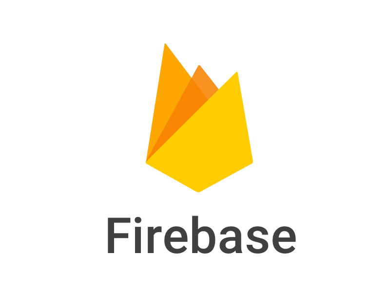

ioBroker.gofiga
=================


## Requirements
* Linux (e.g. Raspberry Pi) / OSX / Windows
* NodeJS >= 8.x
* Google FireBase Gateway

## Installation
1. Install this adapter over the iobroker admin GUI or via `npm install iobroker.gofiga --production` 
1. In the ioBroker GUI, add an adapter instance. 
1. Configure the instance by entering the IP/hostname of your gateway and the security code that can be found on the label at the bottom.

### Troubleshooting installation issues:
#### Linux/OSX:
Make sure you install the most recent released version. If there are compilation errors, you might have to install build-essential:
```
apt-get -y install build-essential
```

